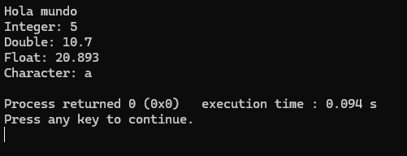

# Programmable-Devices-Repo
C++ coursework and projects for the 'Programmable Devices for IoT' class. Focuses on embedded systems and connectivity.

## Introduction
The first program created was an introduction program in which it was introduced a basic structure of a program in C++.

The program uses iostream, and uses cout to print results, starting with the classic "Hello World!".

## Calculator
The second program created was an introductory program to some of the operators in C++ and the clock_t function. 

It requests the user to input 2 numbers and select an option for the operation to execute. At the end it prints the time it took to execute the program.

