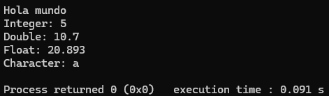
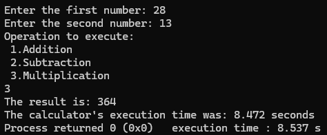
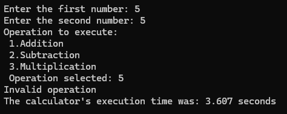
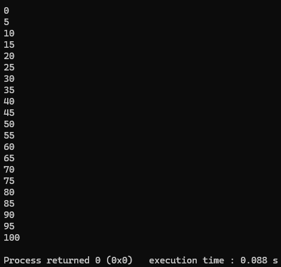
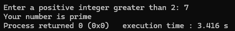
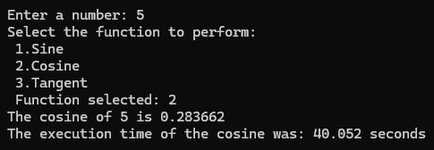
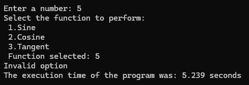

# Programmable-Devices-Repo
C++ coursework and projects for the 'Programmable Devices for IoT' class. Focuses on embedded systems and connectivity.

## Introduction
The first program created was an introduction program in which it was introduced a basic structure of a program in C++.

The program uses iostream, and uses cout to print results, starting with the classic "Hello World!".

## Calculator
The second program created was an introductory program to some of the operators in C++ and the clock_t function. The if conditional was introduced, 

It requests the user to input 2 numbers and select an option for the operation to execute. At the end it prints the time it took to execute the program.

When a different option from the one's given is entered, it prints an 'invalid option' message.

## Counter
The third program created counts from 0 to 100 in steps of 5. The for loop was introduced.

## Prime number
The fourth program created is evaluates wheter a number is prime or not. It was introduced the while loop and implemented the if conditionals.

## Functions
The fifth program created gives the result from the sine, cosine or tangent functions based on the user's input and selection of the function. It prints the time it took to execute the program at the end.

When a different option from the one's given is entered, it prints an 'invalid option' message.

